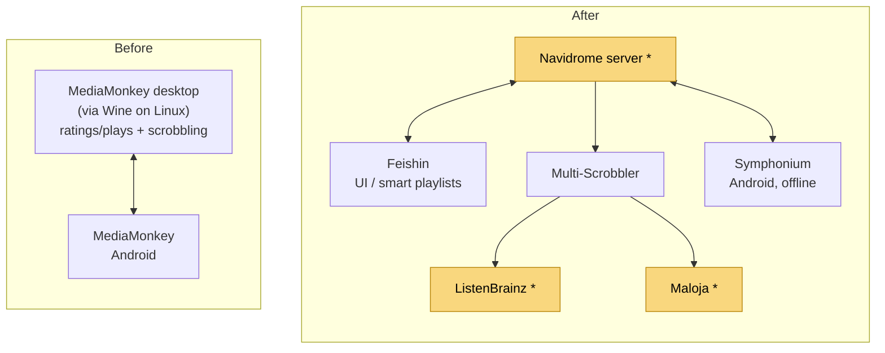
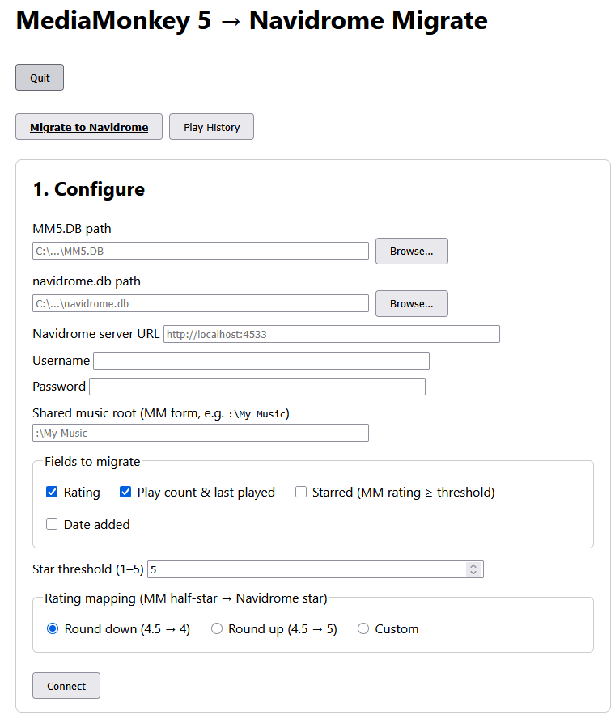
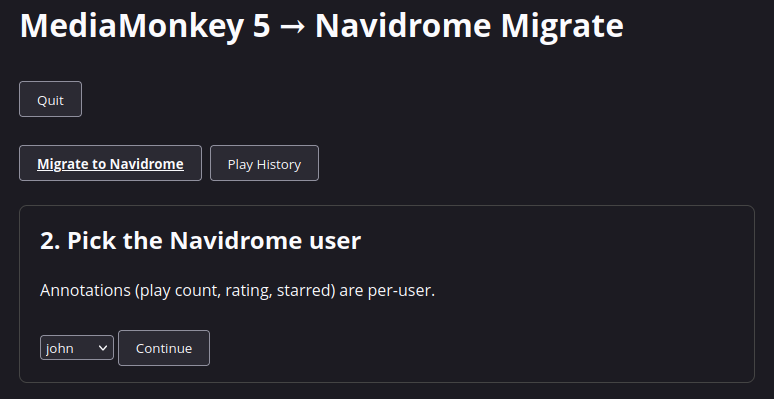
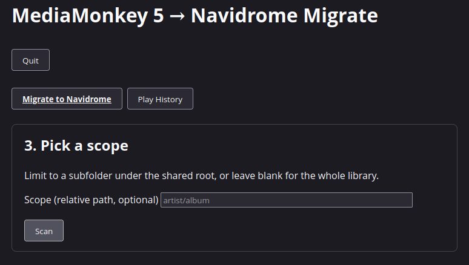
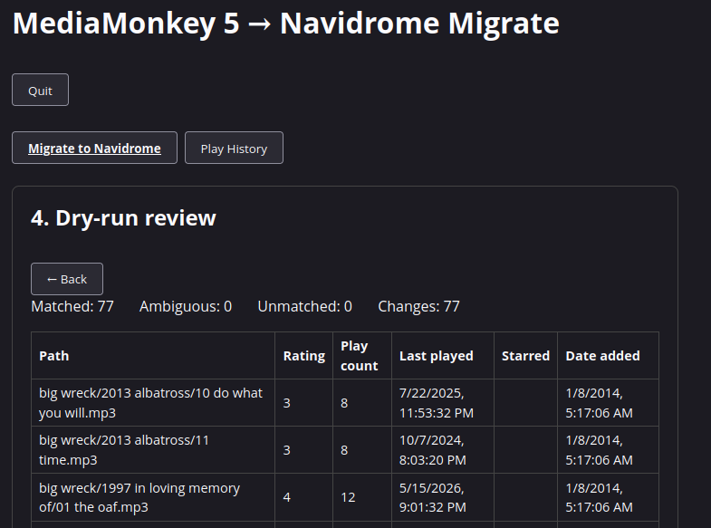
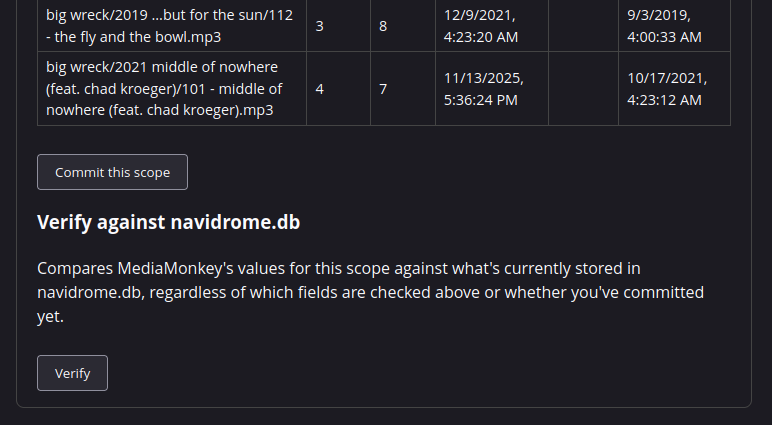
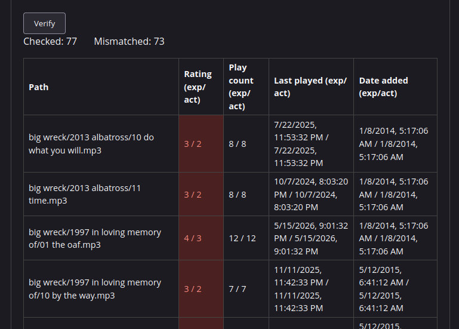
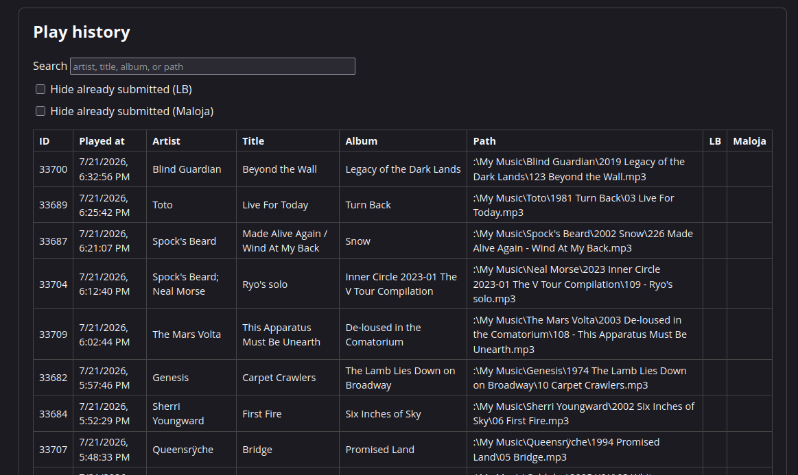

# mediamonkey-navidrome-migrate
MediaMonkey db conversion to Navidrom. Both Navidrome and MM contains alot of non taggable information but no way to convert from MediaMonkey to Navidrome. This repo provides a simple tool to convert your mediamonkey database info into Navidome using Navidroms API

> This works and was built for my own library — it hasn't been tested against anyone else's data. If you run into trouble, please [submit an issue](https://github.com/Jolls/mediamonkey-navidrome-migrate/issues) and we'll get it working.

## Final setup

This tool exists to migrate off MediaMonkey. Here's the stack it was built to move to — MediaMonkey desktop (run under Wine on Linux) and MediaMonkey Android syncing ratings/plays back and forth with each other and handling scrobbling on their own, replaced by a Navidrome server with dedicated apps for playback, playlisting, and scrobbling:



\* migrated by this tool — ratings, play counts, last-played, and date-added into Navidrome directly; full play history backfilled into ListenBrainz and Maloja via the Play History view.

- **Navidrome** — media server (this repo migrates ratings/plays/etc. into it).
- **Feishin** — desktop/web UI, used for building smart playlists.
- **Multi-Scrobbler** — scrobbles plays from Navidrome to both ListenBrainz and Maloja.
- **Symphonium** — Android client, used for offline listening.

## Install

Download the latest binary for your platform from the [Releases](https://github.com/Jolls/mediamonkey-navidrome-migrate/releases) page, then run it:

```
./migrate-windows-amd64.exe   # Windows
./migrate-linux-amd64         # Linux
./migrate-macos-amd64         # macOS Intel
./migrate-macos-arm64         # macOS Apple Silicon
```

It starts a local web UI at `http://localhost:8080` (see terminal output for the exact address).







## What gets migrated

Tracks are matched between the two databases by relative file path or MusicBrainz recording ID (`Songs.SongPath` / MM MBID vs `media_file.path` / `media_file.mbz_recording_id`); no MM fields are written back for matching itself.

| MM5.DB source | navidrome.db destination | Notes |
|---|---|---|
| `Songs.Rating` (0–100) | `annotation.rating` (0–5 stars) | Converted MM 0–100 → 0–10 half-star step, then through a user-configurable rating map (UI-defined) to Navidrome's 0–5 star scale. Written via the Subsonic API. |
| `Songs.Rating` (mapped, see above) | `annotation.starred` / `starred_at` | MM has no native favorite flag; a track is starred if its mapped rating meets the configurable star threshold (default 5 stars). Written via the Subsonic API. |
| `Songs.PlayCounter` | `annotation.play_count` | Direct SQLite upsert; overwrites rather than adds. |
| `Songs.LastTimePlayed` | `annotation.play_date` | Converted from MM's `TDateTime` format to Navidrome's timestamp format; unplayed tracks are left NULL. |
| `Songs.DateAdded` | `media_file.created_at` | Converted from MM's `TDateTime` format, like `LastTimePlayed`. Direct SQLite write — there's no Subsonic API for this field. Relies on Navidrome's scanner only setting `created_at` once, on a file's first scan, and never touching it again on rescans; not independently verified against Navidrome's own source. |
| `Songs.SkipCount` / `Songs.LastTimeSkipped` | *(not migratable)* | Navidrome has no skip-count concept anywhere in its schema — nothing to write this into. |
| `Played` table (per-play history log) | *(not migratable into Navidrome — see below)* | Navidrome's `annotation.play_date` only stores the single most recent play time, not full history, so there's nowhere in navidrome.db to migrate this data to. It can be backfilled into ListenBrainz instead — see "Play History & ListenBrainz" below. |

Album ratings are not migrated directly — Navidrome has no per-album annotation rows and appears to derive album-level rating/starred/play count dynamically from track-level annotations.

Not migrated: MM playlists. Navidrome has no skip-count field to migrate into.

This migration is idempotent — running it multiple times against the same data produces the same result, so it's safe to re-run.



The dry-run review step has a **Verify** button that compares MediaMonkey's values for Rating, Play count, Last played, and Date added against what's actually stored in navidrome.db right now — independent of the checked fields above and usable before or after a commit. Useful for spot-checking a commit that ran, or for finding tracks a previous commit silently missed (e.g. a match that resolved to the wrong/missing `media_file` row).





## Before migrating

In MediaMonkey, select all tracks and run "Save tags to files" first, so as much MM metadata as possible is written into the actual file tags. Navidrome reads tags directly from files during its scan, so this maximizes what gets picked up independent of this tool.

## Play History & ListenBrainz

MediaMonkey logs every individual play in its `Played` table, but has no UI of its own to browse it. This tool's "Play History" view shows that log — searchable, paginated — independent of the Navidrome migration above (it only needs MM5.DB, no Navidrome server/db or scope).



Since Navidrome itself has nowhere to store full play history (see table above), that same view can also **backfill your play history into [ListenBrainz](https://listenbrainz.org)**, if you give it a ListenBrainz user token (from listenbrainz.org/settings). This is a one-time backfill of the past, submitted directly via ListenBrainz's API — not a live sync. Going forward, point Navidrome's own built-in ListenBrainz scrobbling at the same account to keep tracking new plays; this tool doesn't need to run again for that.

Because it's a one-way write to a real external account, submit a small test batch (the most recent handful of plays) first and check it shows up on your ListenBrainz profile before submitting your full history.

Submitted plays are tracked locally in a sidecar file next to `MM5.DB` (`MM5.DB.listenbrainz-submitted.json`), keyed by MediaMonkey's own play-history row IDs — so re-running a submit, or opening the app again later, only ever sends plays that haven't been confirmed submitted yet.

## Potential future features

- Migrate non-smart MM playlists (`Playlists`/`PlaylistSongs`) to Navidrome's `playlist`/`playlist_tracks` tables.
- Migrate smart MM playlists (dynamic/rule-based) to Navidrome smart playlists.
- MusicBrainz recording ID enrichment for ListenBrainz submissions (parsed from `Songs.ExtendedTags`).
